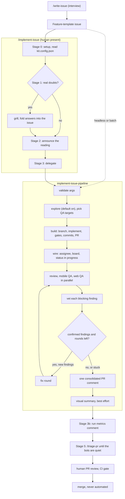

# Agentic workflow

The agentic-kit plugin gives an app a GitHub-native pipeline that takes a feature issue and
produces a reviewable pull request: implemented, reviewed against the kit's rules, and QA'd on a
device or in a browser. It is built from Claude Code primitives (subagents, skills, one workflow)
and ships as the `agentic-kit` plugin from this repository's marketplace. Nothing in it names an
app: every app-specific value comes from the app's `kit.config.json`.

You **author** issues with `/write-issue`, then **run** them through one front door,
`/implement-issue`: a thin orchestrator that judges the issue, grills you only when something
genuinely needs clarifying, delegates to the pipeline workflow
(`agentic-kit:implement-issue-pipeline`), and then triages the AI reviewers' comments on the PR.
For headless and batch runs, call the workflow directly. Whole epics run overnight with the
[runbook](#overnight-runbook).

## Setup

### 1. `kit.config.json`

One file at the app root, read by every package, agent and skill. `npx
@timothyrusso/config-presets init` writes it; only `projectName` is required. The schema is
`@timothyrusso/config-presets/kit.config.schema.json`.

```json
{
  "$schema": "./node_modules/@timothyrusso/config-presets/dist/kitConfig.schema.json",
  "projectName": "acme",
  "featuresRoot": "features",
  "appRoot": "app",
  "github": {
    "projectNumber": 3,
    "projectId": "<board node id>",
    "statusFieldId": "<Status field id>",
    "statusOptions": { "todo": "<id>", "inProgress": "<id>", "done": "<id>" },
    "labels": ["bug", "enhancement"]
  },
  "qa": {
    "targets": ["mobile"],
    "simulator": "iPhone 17 Pro",
    "metroPort": 8082,
    "baseline": {
      "setup": "Sign in with the test account",
      "launch": "The Home tab with the greeting",
      "firstScreens": ["Home", "Profile"],
      "navigation": ["Open an item from Home", "Go back"]
    }
  },
  "lint": { "allowedHooksInViews": ["useTheme", "useT", "useStyles"], "dashes": "forbid" },
  "i18n": { "catalogPath": "features/core/translations/catalog", "languages": ["en", "it"] }
}
```

| Field | Used by |
| --- | --- |
| `projectName` | Every prompt; the run comment and visual summary markers (`<!-- <slug>:pipeline-run -->`, `<!-- <slug>:visual-summary -->`) |
| `featuresRoot`, `appRoot` | explorer, feature-builder, code-reviewer, finding-vetter, and the lint and dependency rules |
| `github.*` | write-issue (Status `todo`), the pipeline's PR wiring (Status `inProgress`) |
| `qa.targets` | The QA surfaces the explorer may choose, and the fallback when it cannot |
| `qa.simulator`, `qa.metroPort` | qa-engineer (device and Metro port), qa-web-engineer (port) |
| `qa.baseline` | qa-baseline: the standing checks run for every feature |
| `lint.allowedHooksInViews` | `arch/prefer-viewmodel`, feature-builder and code-reviewer |

The board ids come from `gh project field-list <number> --owner <owner> --format json`. The
board owner is the owner of the repository's `origin`.

### 2. Install the plugin

```text
/plugin marketplace add timothyrusso/agentic-kit
/plugin install agentic-kit@agentic-kit
```

`config-presets init` already writes the marketplace and the plugin into the app's
`.claude/settings.json`, with the deny list and the `agent-device` allow. To try a local
checkout of the kit: `claude --plugin-dir <path to agentic-kit>/plugin`.

### 3. Prerequisites on the machine

- **`gh`** authenticated for the app's repository, with the `project` scope for the board.
- **agent-device** installed and configured (the `agent-device-configuration` skill walks
  through it): the mobile QA engine.
- **agent-browser** (`npm i -g agent-browser && agent-browser install`): the web QA engine, only
  for apps with `web` in `qa.targets`.
- The app buildable on the simulator named in `qa.simulator`, and Metro on `qa.metroPort`.
- **ffmpeg** with libwebp, optional: the visual summary converts screenshots with it and falls
  back to PNG.

### 4. The app's own docs

Every agent reads the kit docs shipped in the plugin (`${CLAUDE_PLUGIN_ROOT}/docs/`), then the
app's `docs/ARCHITECTURE.md` (its deltas; they win on conflict) and `CLAUDE.md`. The app's
`CLAUDE.md` must say that commits carry no `Co-Authored-By` trailer: that line overrides the
harness default. Each app commits `.claude/agent-memory/` for the QA agents' lessons (see the
plugin's `agent-memory/README.md`).

## The pieces

| Piece | Plugin path | Role |
| --- | --- | --- |
| Feature issue template | `templates/ISSUE_TEMPLATE/feature.yml`, copied into the app by `init` | The input contract: `### Description` and `### Acceptance criteria` |
| `write-issue` | `skills/write-issue/` | Interviews you until the issue is unambiguous, creates it with `[Feature]: `, the `enhancement` label when listed, and Status `todo` on the board (`scripts/write-issue.mjs`) |
| `explorer` | `agents/explorer.md` | Read-only. Maps the issue onto the architecture (feature, tier, files, pattern, risks) and picks the QA targets |
| `feature-builder` | `agents/feature-builder.md` | Implements, runs the gates once per round, commits in small layer-aligned commits, opens the PR |
| `code-reviewer` | `agents/code-reviewer.md` | Read-only. Reviews the diff against the rules the linters do not enforce |
| `qa-engineer` | `agents/qa-engineer.md` | Mobile QA with agent-device: baseline plus one item per acceptance criterion |
| `qa-web-engineer` | `agents/qa-web-engineer.md` | Web QA with agent-browser; same contract, never a simulator |
| `finding-vetter` | `agents/finding-vetter.md` | Read-only skeptic: tries to refute one blocking finding before it can trigger a fix |
| `qa-baseline` | `skills/qa-baseline/` | The standing regression checks, filled from `qa.baseline` |
| `implement-issue` | `skills/implement-issue/` | The front door: judge, grill if needed, delegate, report, then triage |
| `triage-pr` | `skills/triage-pr/` | The bot-review loop; bots listed in `triage-bots.json` (an app may override with `.claude/triage-bots.json`) |
| `implement-issue-pipeline` | `workflows/implement-issue-pipeline.js` | The pipeline, single encoding, with the canonical defaults |
| Run metrics | `scripts/run-metrics.mjs` | Per-agent model, wall-clock and token spend, from the harness transcripts |
| Supporting skills | `skills/` | `dogfood`, `handoff`, `grilling`, `grill-me`, `grill-deck`, `teach`, `writing-great-skills`, `docs-audit`, `agent-device` |

Agents are addressed as `agentic-kit:<name>`.

## Entry points



There is no `--auto` flag: the judgment itself is the router, and PR review is the approval gate.

## `/implement-issue`

```text
/implement-issue <issue> [--skip-explore] [--skip-review] [--skip-qa] [--skip-triage] [--worktree] [--max-fix N]
```

| Stage | Interactive? | What happens |
| --- | --- | --- |
| 0 Setup | no | Reads `kit.config.json` (stops if missing), reads the issue, checks the template |
| 1 Judge | only on doubts | Two lenses: is it clear enough to build, and is it a good idea. Doubts with teeth start `grilling`; the answers are folded back into the issue body with your approval |
| 2 Announce | no | States its reading and proceeds without waiting: interrupt if it is wrong |
| 3 Delegate | no | Runs the workflow with `{ issue, kitConfig, ...overrides }` |
| 3b Metrics | no | Posts the run metrics comment |
| 4 Report | no | PR link, verdicts, fix rounds, anything outstanding. Never merges |
| 5 Triage | only on judgment calls | Runs `/triage-pr` on the PR, announced, not asked |

Flags are overrides; the defaults live in the workflow. `--skip-triage` is the one skill-local
flag. `--worktree` isolates the code-touching agents in git worktrees, at the cost of a cold
install and build.

### The PR contract

- **Title** meaningful, **body empty**: other reviewer automation rewrites the body on every
  push.
- **One pipeline comment**, posted at the end even when a stage aborts: a status header plus
  collapsible build, review, QA and vetting reports. Agents never post their own comments.
- **At most one visual summary comment**, only when the explorer proposed visual subjects: up to
  four after-only screenshots from device QA, downscaled and converted to WebP, pushed to the
  per-PR branch `qa-evidence/pr-<n>` (never the feature branch), linked from
  `raw.githubusercontent.com`. A re-run finds the comment by its marker as the first line and
  edits it in place. Every failure here is logged and swallowed.
- **One run metrics comment**, last, from `scripts/run-metrics.mjs`. Diagnostic only.

## The pipeline workflow

`agentic-kit:implement-issue-pipeline` is the single encoding of the build stages. It is
gate-free: clarification happens before it, approval at PR review.

- **Per-criterion QA.** QA returns one item per test (id, the criterion it verifies, verdict,
  note); the overall verdict is derived in code, so PASS means every criterion passed.
- **Adversarial vetting.** Every blocking finding gets a `finding-vetter` that tries to refute it
  against the diff, the code and the QA evidence. Refuted findings are dropped and reported;
  device claims that cannot be verified without driving the app again become `suspects`, never
  auto-fixed, and block a clean pass.
- **Convergent fix loop.** Up to `maxFix` rounds, each fingerprinted; a round that reproduces an
  earlier findings set stops the loop with `stuck: true`. Later rounds are told what already
  failed and which findings `[PERSISTS]`.
- **Device readiness.** qa-engineer pins one device (a physical device, else a booted or bootable
  iOS simulator, else an Android emulator, else `QA NOT PERFORMED`) and skips the native build
  when the diff is JS-only on a warm device.

| Arg | Default | Meaning |
| --- | --- | --- |
| `issue` | required | The issue number |
| `kitConfig` | read by the caller | The parsed `kit.config.json` (workflow scripts cannot read files) |
| `explore` | `true` | Run the explorer |
| `explorerReport` | none | A ready report; skips exploration |
| `clarifications` | none | Fallback when the answers were not folded into the issue |
| `review` | `true` | Run the code review |
| `qa` | `true` | Master switch for QA |
| `qaTargets` | explorer decides | `['mobile']`, `['web']`, both, or `[]`; falls back to `qa.targets` if exploration fails |
| `worktree` | `false` | Isolate code-touching agents |
| `maxFix` | `2` | Fix round cap |

It returns `{ prUrl, explored, reviewVerdict, qaVerdict, qaItems, qaWebVerdict, qaWebItems,
fixAttempts, stuck, passed, outstanding, suspects, refuted }`. A lane that did not run reads
`'skipped'`.

CI gates every PR regardless: the app's `pr-checks.yml` from `config-presets` runs commitlint,
the architecture check with one marker comment, `npm run check` and an `expo export` bundle.

## `/triage-pr`

After the PR opens, the AI review bots comment on their own schedule. `triage-pr` is a
main-thread skill (it holds human gates) that drives their threads to zero:

- Every bot finding is vetted: **confirmed** is fixed, committed, and the thread closed with the
  SHA once the push is verified; **refuted** gets a short evidence-cited reply and is resolved;
  **suspect or judgment** goes to you in chat.
- It terminates when no bot thread is open, no bot check is pending, and one grace poll stays
  quiet. It hands back, with the resume command, on the 10-wave cap (`--max-rounds N`), a closed
  watch window, or a findings set that repeats.
- Human comments are never acted on. It writes no reports, only thread replies and a closing
  message.

## How to use it

1. `/write-issue <idea>`, or open a Feature-template issue by hand.
2. At the keyboard: `/implement-issue <n>`. Headless: run the workflow with
   `{ issue: <n>, kitConfig }` (add `qa: false` where no device is reliable), then
   `/triage-pr <pr>` by hand.
3. Review the PR: one pipeline comment, one metrics comment, maybe one visual summary.
4. Merge when satisfied. The pipeline never merges.

## Overnight runbook

A whole epic runs unattended from one prompt: an orchestrating session reads the epic, and for
each child issue spawns a fresh implementer, then a reviewer, merges the child into an
integration branch, and ends with one PR into `main` for a human in the morning.

### Before the night

- A Claude Code session started in the target repository, with permissions that allow `gh`,
  `npm`, `git`, `xcodebuild`, `node` and `agent-device` without prompts.
- Metro on the port in `qa.metroPort`, never a port another project on the machine uses.
- The simulator in `qa.simulator` available.
- The epic lists its children in order, names its integration branch and its gates, and has a
  final QA child that files issues instead of fixing.
- Whatever the epic depends on (a previous epic merged, kit packages published) is done.

### The prompt

Paste this to a fresh session in the target repository, replacing `<epic>`:

> Run epic #<epic> of this repository end to end, unattended. Read the epic and every child
> issue first, then the kit docs (`ARCHITECTURE.md`, `ERROR_HANDLING.md`, `EFFECT_PRIMER.md`)
> and this repository's `CLAUDE.md`. Create the integration branch named in the epic from
> `main`. For each child issue in order: spawn one fresh implementer subagent with the child
> issue as its only scope; when it reports done, spawn one reviewer subagent that re-runs the
> gates listed in the epic and reviews the diff against the docs; fix rounds are capped at 3 per
> child; when green, open a PR from the child branch into the integration branch, squash-merge
> it, and set the child issue to Done on the project board. If a child is still red after 3 fix
> rounds, stop the epic: leave the branch and PR as they are, comment on the epic naming the
> failing child and the last error, and go idle. Never merge into `main`. When every child is
> merged, run the final QA child exactly as written (it files issues, it does not fix), then
> open one PR from the integration branch into `main` whose description summarises every child,
> the QA report and the issues filed, and comment on the epic with the PR link. Do not ask
> questions; every decision is in the epic and the docs. If something is genuinely undecidable,
> choose the option that touches less and record it in the PR description under "Assumptions".

### In the morning

Read the epic's last comment. If it names a failing child, the branch and its PR are as the
reviewer left them: fix or re-scope, then resume from that child. Otherwise review the one PR
into `main`, its QA report and the issues it filed, check the change by hand on the platforms
the QA did not cover, and merge.
